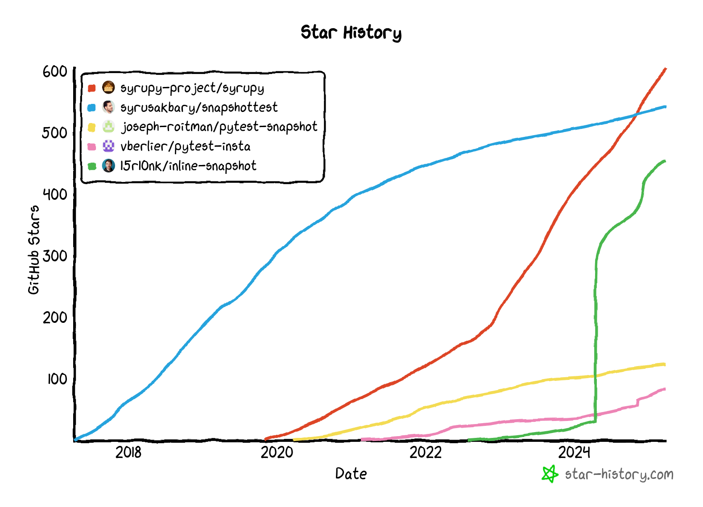

inline-snapshot is not the only snapshot library for python.
There are several others to:

* [syrupy](https://github.com/syrupy-project/syrupy)
* [snapshottest](https://github.com/syrusakbary/snapshottest)
* [pytest-snapshot](https://github.com/joseph-roitman/pytest-snapshot)
* [pytest-insta](https://github.com/vberlier/pytest-insta)

All of them have things that make them unique. What sets inline-snapshot apart is the ability to store snapshots directly in the source code. This leads to less indirections in the code which improves readability and code-reviews.

If you miss a feature that is available in other libraries, please let me know.

