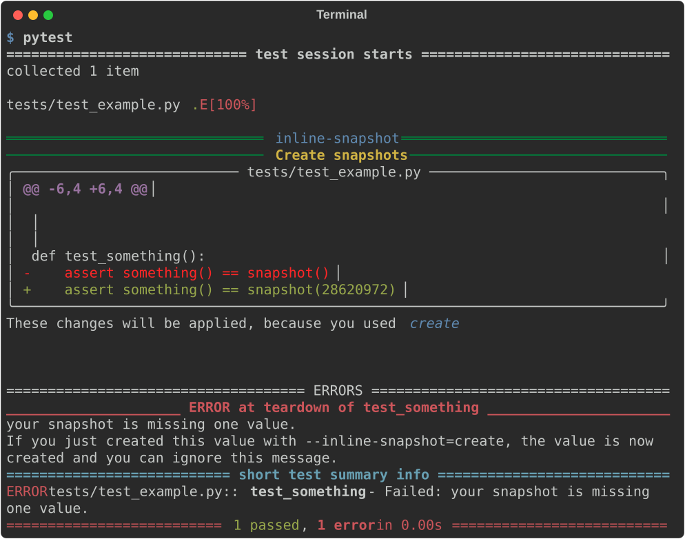
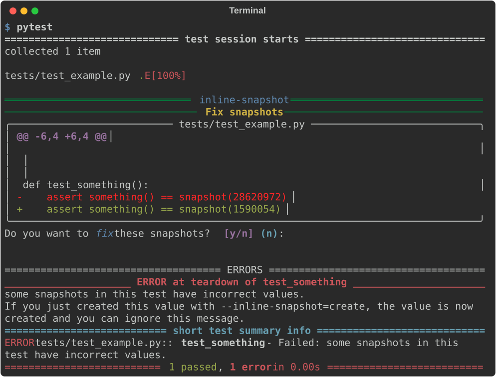
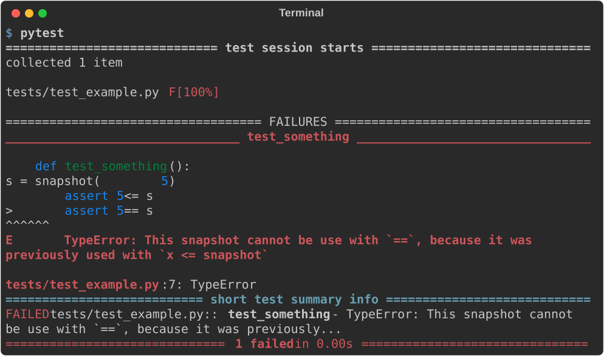

--8<-- "README.md:Header"


# Welcome to inline-snapshot


inline-snapshot is a snapshot testing library that stores values directly in your source code. This makes snapshots easy to read and review, and it saves you time when writing tests.
It is also possible to store values in [external](external/external.md) files when needed.

inline-snapshot is generally designed as a composable library which can be [customized](plugin.md#customize-examples) by the user.
This introduction will give you an overview of all the features.


Let's start with a simple example:

<!-- inline-snapshot: first_block outcome-passed=1 outcome-errors=1 -->
``` python title="test_example.py"
from inline_snapshot import snapshot


def something():
    return 1548 * 18489


def test_something():
    assert something() == snapshot()
```

You can use `snapshot()` instead of the value that you want to compare against. Then run the tests with `pytest` to record the correct values.

<!-- inline-snapshot-run: create outcome-passed=1 outcome-errors=1 -->
<!-- inline-snapshot-last-output: pytest -->


Your tests will fail if you change your code by adding `// 18`.
Maybe the failure points to a bug that you should fix, or maybe the code is correct and you want to update your test results.

``` python hl_lines="5" title="test_example.py"
from inline_snapshot import snapshot


def something():
    return (1548 * 18489) // 18


def test_something():
    assert something() == snapshot(28620972)
```

Changing snapshots is almost as simple as creating them. You can run `pytest` again, and inline-snapshot will ask whether you want to change the snapshot.

<!-- inline-snapshot-run: review stdin="y\n" outcome-passed=1 outcome-errors=1 -->
<!-- inline-snapshot-last-output: pytest -->


Review these changes carefully so that you do not record the result of buggy code in your tests.

## Supported operations

You can use `snapshot(x)` in assertions with a limited set of operations:

- [`value == snapshot()`](eq_snapshot.md) to compare with something,
- [`value <= snapshot()`](cmp_snapshot.md) to ensure that something gets smaller or larger over time, such as the number of iterations in an algorithm you want to optimize,
- [`value in snapshot()`](in_snapshot.md) to check if your value is in a known set of values,
- [`snapshot()[key]`](getitem_snapshot.md) to generate new sub-snapshots on demand.

!!! warning
    One snapshot can only be used with one operation.
    <!-- inline-snapshot: first_block outcome-failed=1 -->
    ``` python
    from inline_snapshot import snapshot


    def test_something():
        s = snapshot(5)
        assert 5 <= s
        assert 5 == s
    ```

    This code does not work and creates the following error:

    <!-- inline-snapshot-last-output: pytest -->
    

## Supported usage

You can place `snapshot()` anywhere in your tests.

=== "global scope"
    You can reuse one snapshot multiple times when you want to compare with the same value.


    <!-- inline-snapshot: create fix first_block outcome-passed=2 -->
    ``` python
    from inline_snapshot import snapshot


    def something():
        return 21 * 2


    result = snapshot(42)


    def test_something():
        ...
        assert something() == result


    def test_something_again():
        ...
        assert something() == result
    ```

=== "inside loops"
    You can use `snapshot()` inside loops:

    <!-- inline-snapshot: create fix first_block outcome-passed=1 -->
    ``` python
    from inline_snapshot import snapshot


    def test_loop():
        for name in ["Mia", "Eva", "Leo"]:
            assert len(name) == snapshot(3)
    ```

=== "pass as arguments"
    You can pass `snapshot()` as an argument to a function:

    <!-- inline-snapshot: create fix first_block outcome-passed=1 -->
    ``` python
    from inline_snapshot import snapshot


    def check_string_len(string, snapshot_value):
        assert len(string) == snapshot_value


    def test_string_len():
        check_string_len("abc", snapshot(3))
        check_string_len("1234", snapshot(4))
        check_string_len(".......", snapshot(7))
    ```

    You can also use [`snapshot_arg()`](snapshot_arg.md) to convert function arguments into snapshots.

    <!-- inline-snapshot: create fix first_block outcome-passed=1 -->
    ``` python
    from inline_snapshot import snapshot_arg


    def check_string_len(string, length=...):
        assert len(string) == snapshot_arg(length)


    def test_string_len():
        check_string_len("abc", length=3)
        check_string_len("1234", length=4)
        check_string_len(".......", length=7)
    ```

=== "pytest.mark.parametrize"

    You can use `snapshot()` as a parameter in [`pytest.mark.parametrize`](howto/parametrize.md):

    <!-- inline-snapshot: create fix first_block outcome-passed=2 -->
    ``` python
    import pytest
    from inline_snapshot import snapshot


    @pytest.mark.parametrize(
        "name,length",
        [
            ("Mia", snapshot(3)),
            ("Noah", snapshot(4)),
        ],
    )
    def test_name_length(name, length):
        assert len(name) == length
    ```


## dirty-equals

inline-snapshot has built-in support for [dirty-equals](eq_snapshot.md#dirty-equals). This means that you can replace parts of your snapshot with dirty-equals expressions, and inline-snapshot will preserve these values the next time it changes your snapshot.

<!-- inline-snapshot: create fix first_block outcome-passed=1 -->
``` python
from dirty_equals import IsStr
from inline_snapshot import snapshot


def user_response():
    return {"id": "usr_123", "name": "Mia"}


def test_user_response():
    assert user_response() == snapshot(
        {"id": IsStr(regex=r"usr_\d+"), "name": "Mia"}
    )
```

Here, inline-snapshot can update the `"name"` field later without replacing the `IsStr(...)` matcher for `"id"`.

## Code generation

inline-snapshot represents your values as source code. You can customize code generation in your `conftest.py`, or you can write a [plugin](plugin.md) for [specific libraries](third_party.md).

<!-- inline-snapshot-lib-set: money.py -->
``` python title="money.py"
from dataclasses import dataclass


@dataclass
class Money:
    amount: int
    currency: str

    @staticmethod
    def euro(amount):
        return Money(amount, "EUR")
```

<!-- inline-snapshot-lib-set: conftest.py -->
``` python title="conftest.py"
from inline_snapshot.plugin import Builder
from inline_snapshot.plugin import customize
from money import Money


@customize
def money_handler(value, builder: Builder):
    if isinstance(value, Money) and value.currency == "EUR":
        return builder.create_call(Money.euro, [value.amount])
```

inline-snapshot will then use `Money.euro` to create the Money type if it has to.
It will also generate the missing imports if needed.

<!-- inline-snapshot: create fix first_block outcome-passed=1 -->
``` python
from money import Money
from inline_snapshot import snapshot


def test_total():
    assert Money(12, "EUR") == snapshot(Money.euro(12))
```

## :heart: Insiders

I have started to offer [insider](insiders.md) features for inline-snapshot.
I will only release features as insider features if they will not cause problems for you when used in an open source project.
This mainly includes tooling around inline-snapshot and better integration into IDEs.

I hope this will allow me to spend more time working on open source projects.
Thank you for using inline-snapshot, the future will be 🚀.

The next feature, which will be released when I reach 20 sponsors, is the ability for inline-snapshot to fix normal assertions that do not use `snapshot()`, such as:

``` python
assert 1 + 1 == ...
```

This allows you to fix assertions in codebases which do not use inline-snapshot jet.
You can learn more about this feature [here](fix_assert.md).


--8<-- "README.md:Feedback"
